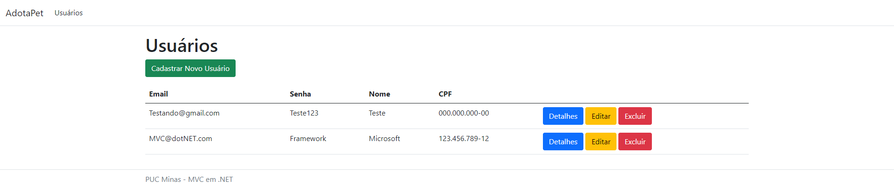
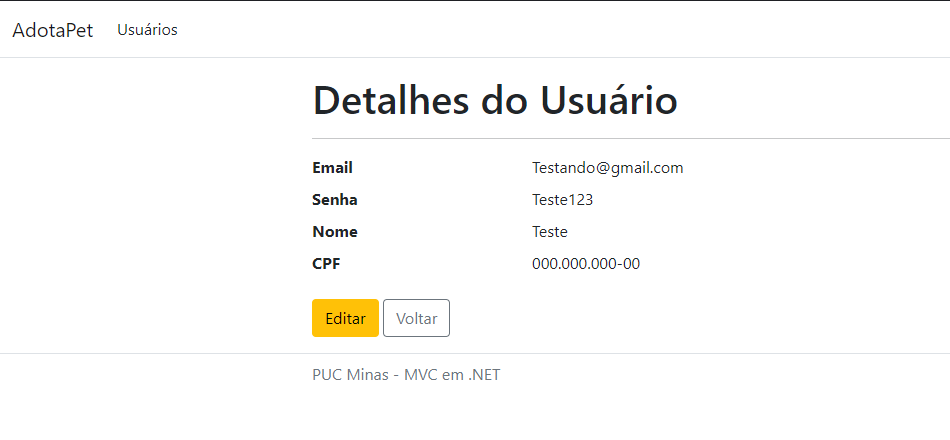

# Programação de Funcionalidades

Pré-requisitos: <a href="2-Especificação do Projeto.md"> Especificação do Projeto</a>, <a href="3-Projeto de Interface.md"> Projeto de Interface</a>, <a href="4-Metodologia.md"> Metodologia</a>, <a href="3-Projeto de Interface.md"> Projeto de Interface</a>, <a href="5-Arquitetura da Solução.md"> Arquitetura da Solução</a>

Implementação do sistema descritas por meio dos requisitos funcionais e/ou não funcionais. Deve relacionar os requisitos atendidos os artefatos criados (código fonte) além das estruturas de dados utilizadas e as instruções para acesso e verificação da implementação que deve estar funcional no ambiente de hospedagem.

# Criação de telas

## Anúncios

Feito por: Beatriz Iglesias

Descrição: Criei um CRUD simples de anúncios com o intuito de me familiarizar com o framework, a tabela Anuncios criada é meramente ilustrativa com campos fictícios.
Achei o framework bem simples de usar e a geração automática de views acelera bastante o desenvolvimento, não tive difivuldades na utilização da ferramenta.

- Home de anúncios

  

- Listagem de anúncios

  

- Detalhes de anúncio

  

- Criar  anúncio

  

## Login

Feito por: Leandro Tavares

Descrição: Tive dificuldades com a conexão com o banco de dados devido a string de conexão da vídeo aula não funcionar no meu projeto. 
Achei interessante a praticidade do framework do MVC, pois acelera a produção do projeto. 

- Tela de Login

  

## Usuários

Feito por: Vinícius Mendes

Descrição: CRUD em MVC que interage com a tabela "Usuarios" do banco de dados "AdotaPet". Já estava familiarizado com o MVC em JS, de início, achei o código e estrutura em C#
um pouco poluídos, mas logo me acostumei. Adorei a praticidade do .NET, excelente para produtividade.

- Listagem de usuários

  

- Detalhes de usuário

  

- Cadastrar usuário

  

- Editar Usuário
  
  

- Excluir Usuário

  

